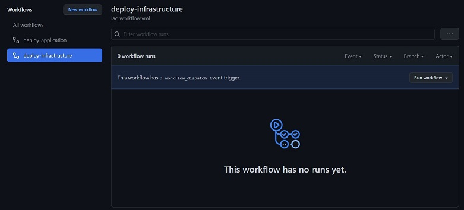
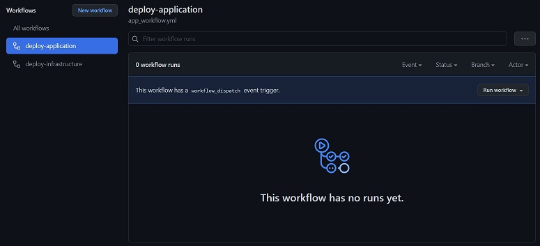

# **HelpDeskServiceRequest**

The HelpDeskServiceRequest repository is an end-to-end infrastructure and application deployment utilizing GitHub Actions. The Azure infrastructure is deployed via workflow utilizing Azure Bicep and the application is deployed via workflow utilizing .NET.

## **Prerequisites**

To deploy the Help Desk Service Request application to Azure using GitHub Actions, it is necessary to complete some pre-requisites.

### **Certificate and Domain Name**

To fullly deploy and secure the infrastructure and application code, a wildcard certificate in base64 encoded format and a registered domain name are required. There are instructions later in this document on converting an existing wildcard certificate from PFX format to base64 encoded format.

### **Azure Setup**

To prepare the Azure environment for the infrastructure and application deployment, complete the following steps:

1. Create the Resource Groups
2. Create the Azure Key Vault and the necessary secrets
3. Create the Azure User Assigned Managed Identity and assign it permissions to the Azure Key Vaul
4. Create the Service Principal

#### **Resource Groups**

The application deployment uses two Azure Resource Groups (core and app). The 'core' Resource Group is created prior to the deployment, and the 'app' Resource Group is created during the deployment. Prior to creating the 'core' Resource Group it is necessary to define a series of variables that will be used throughout the deployment. These variables are used to build resource names and are used in any AZ CLI script, PowerShell script, ARM Template, and YAML workflow to deploy the infrastructure and application. The following variables must be defined:

- `workload` - defines the name of the workload to be deployed (e.g. `helpdesk`, `hdsr`)
- `env` - defines the name of the environment to be deployed to (e.g. `prod`, `dev`, or `test`)
- `azureRegion` - defines the name of the Azure Region to be deployed to (e.g. `eastus`, `eastus2`)

The 'core' Resource Group can be created in the Azure Portal, or using Azure CLI or Azure PowerShell. This guide focuses on using AZ CLI. 

To create the 'core' Resource Group, open a terminal and run the following command using the appropriate variables:

```powershell
$workload = 'hdsr'
$env = 'prod'
$azureRegion = 'eastus'
$resourceGroupName = 'rg-$workload-$env-$azureRegion-core'

az group create -n $resourceGroupName -l $azureRegion
```

#### **Azure Key Vault**

The application deployment uses an Azure Key Vault to store two secrets. The first secret is for the admin password of any resources deployed, and the second secret is for the base64 encoded PFX certificate used by the Azure Application Gateway.

##### **Create the Azure Key Vault**

To create the Azure Key Vault, open a terminal and run the following command using the appropriate variables:

```powershell
$workload = 'hdsr'
$env = 'prod'
$azureRegion = 'eastus'
$resourceGroupName = 'rg-$workload-$env-$azureRegion-core'
$keyValutName = 'kv-$workload-$env-$azureRegion'

az keyvault create -n $keyVaultName -g $resourceGroupName --enable-soft-delete true --retention-days 7 --enable-purge-protection true --enabled-for-deployment true --enabled-for-disk-encryption true --enabled-for-template-deployment true
```

##### **Create the Azure Key Vault Secret for the Admin Password**

To create the Azure Key Vault Secret for the admin password, open a terminal and run the following command using the appropriate variables:

```powershell
$workload = 'hdsr'
$env = 'prod'
$azureRegion = 'eastus'
$keyValutName = 'kv-$workload-$env-$azureRegion'
$adminPassword = 'adminPassword'
$secretValue = 'abc123!'

az keyvault secret set -n $secretName --vault-name $keyVaultName --value $secretValue
```

##### **Create the Azure Key Vault Secret for the base64 Encoded PFX Certificate**

Before creating the Azure Key Vault Secret for the base64 encoded PFX certificate, it is necessary to convert an existing PFX certificate to base 64 using PowerShell.

To convert an existing PFX certificate to base 64, open a PowerShell terminal and run the following command using the appropriate variables:

For example:

```powershell
$pfxPath = 'C:\certificates\wildcard.pfx'
$txtPath = 'wildcard.txt'
$fileContentBytes = get-content '$certificatePath' -Encoding Byte
[System.Convert]::ToBase64String($fileContentBytes) | Out-File $txtPath
```

After converting the PFX certificate to base64 encoded format, open the text file and copy the contents. This is used as the secret value in the next step.

To create the Azure Key Vault Secret for the base64 encoded PFX certificate, open a terminal and run the following command using the appropriate variables:

```powershell
$workload = 'hdsr'
$env = 'prod'
$azureRegion = 'eastus'
$keyValutName = 'kv-$workload-$env-$azureRegion'
$adminPassword = 'adminPassword'
$secretValue = 'abc123!'

az keyvault secret set -n $secretName --vault-name $keyVaultName --value $secretValue
```

#### **Azure User Assigned Managed Identity**

The application deployment uses an Azure User Assigned Managed Identity to extract the wildcard certificate during the deployment of the Azure Application Gateway. This identity needs access rights over the secrets stored within the Azure Key Vault.

##### **Create the Azure User Assigned Managed Identity**

To create the Azure User Assigned Managed Identity, open a terminal and run the following command using the appropriate variables:

```powershell
$workload = 'hdsr'
$env = 'prod'
$azureRegion = 'eastus'
$resourceGroupName = 'rg-$workload-$env-$azureRegion-core'
$managedIdentityName = 'id-$workload-$env-$azureRegion'

az identity create -n $managedIdentityName -g $resourceGroupName
```

##### **Assign the Azure User Assigned Managed Identity to an Azure Key Vault Access Policy**

To assign the Azure User Assigned Managed Identity to an Azure Key Vault Access Policy, open a terminal and run the following command using the appropriate variables:

```powershell
$workload = 'hdsr'
$env = 'prod'
$azureRegion = 'eastus'
$resourceGroupName = 'rg-$workload-$env-$azureRegion-core'
$keyValutName = 'kv-$workload-$env-$azureRegion'
$managedIdentityName = 'id-$workload-$env-$azureRegion'

$managedIdentityPrincipalId=az identity show -g $resourceGroupName -n $managedIdentityName --query principalId

az keyvault set-policy -g $resourceGroupName -n $keyVaultName --object-id $managedIdentityPrincipalId--secret-permissions get
```

#### **Service Principal**

To deploy the Azure infrastructure and the application code, a Service Principal, also known as an App Registration, needs to be created in  Azure Active Directory. The [`az ad sp create-for-rbac`](https://docs.microsoft.com/en-us/cli/azure/create-an-azure-service-principal-azure-cli) command is used to create the Service Principal with an appropriate role at the appropriate scope for deployment.

```powershell
az ad sp create-for-rbac -n 'name of service principal' --role Contributor --scopes 'subscription id' --sdk-auth
```

The output of the command will appear as follows:

```json
{
  "clientId": "The Client ID of the Service Principal",
  "clientSecret": "The Client Secret of the Service Principal",
  "subscriptionId": "The Azure Subscription ID",
  "tenantId": "The Azure Active Directory Tenant ID",
  "activeDirectoryEndpointUrl": "https://login.microsoftonline.com",
  "resourceManagerEndpointUrl": "https://management.azure.com/",
  "activeDirectoryGraphResourceId": "https://graph.windows.net/",
  "sqlManagementEndpointUrl": "https://management.core.windows.net:8443/",
  "galleryEndpointUrl": "https://gallery.azure.com/",
  "managementEndpointUrl": "https://management.core.windows.net/"
}
```

Copy and past the output in a safe location. The `clientId`, `clientSecret`, `subscriptionId`, and `tenantId` are needed for the GitHub repository.

### **GitHub Setup**

To prepare the GitHub Repository for the infrastructure and application deployment using GitHub Actions, complete the following steps:

1. Create a GitHub account
2. Fork the HelpDeskServiceRequest repository
3. Create the GitHub Actions secret
4. Set the values for parameters used in the workflow files

#### **Create a GitHub Account**

To create an account with GitHub, navigate to <https://github.com>, and click `Sign up`.

#### **Fork the Repository**

To deploy the Azure Infrastructure and Application Code using [GitHub Actions](https://docs.github.com/en/actions), it is necessary to [fork](https://docs.github.com/en/get-started/quickstart/fork-a-repo) the `HelpDeskServiceRequest` repository.

To fork the repository, log in to GitHub, navigate to <https://github.com/joshuawaddell/HelpDeskServiceRequest> repository, and click `Fork` in the top right hand corner as seen here:


For additional instructions on how to fork a repository, visit: <https://docs.github.com/en/get-started/quickstart/fork-a-repo>

#### **Create the GitHub Secret for the Azure Credentials**

To deploy the Azure Infrastructure and Application Code using [GitHub Actions](https://docs.github.com/en/actions), it is necessary to configure access to the Azure Envrionment using the credentials created in the setup of the Service Principal. These credentials will be saved to the repository as an [Encrypted Secret](https://docs.github.com/en/actions/security-guides/encrypted-secrets).

To create an Encrypted Secret, follow the steps outlined here: <https://docs.github.com/en/actions/security-guides/encrypted-secrets#creating-encrypted-secrets-for-a-repository>

When prompted to enter a value for your secret, copy the output from the setup of the Service Principal above. Only the `clientId`, `clientSecret`, `subscriptionId`, and `tenantId` are needed for the GitHub repository. For example:

```json
{
  "clientId": "The Client ID of the Service Principal",
  "clientSecret": "The Client Secret of the Service Principal",
  "subscriptionId": "The Azure Subscription ID",
  "tenantId": "The Azure Active Directory Tenant ID",
}
```

#### **Set Workflow Parameters**

The GitHub Actions worklow in the repository defines a series of parameters that are used for both the deployment of the Azure infrastructure and the application code. Prior to deployment, it is necessary to update the parameter values. 

##### **Update the iac_workflow Parameters**

From the forked repository, click the `<> Code` menu, click the `.github/workflows` folder, and click the `iac_workflow.yml` to open the workflow. Click the `edit` button on the right hand side of the screen and update the following parameters (descriptions are provided in the workflow file) with appropriate values:

- adminPassword
- adminUserName
- applicationGatewayManagedIdentityName
- applicationGatewayManagedIdentityResourceGroupName
- azureRegion
- certificate
- env
- keyVaultName
- keyVaultResourceGroupName
- rootDomainName
- sslCertificateName
- workload

##### **Update the app_workflow Parameters**

From the forked repository, click the `<> Code` menu, click the `.github/workflows` folder, and click the `app_workflow.yml` to open the workflow. Click the `edit` button on the right hand side of the screen and update the following parameters (descriptions are provided in the workflow file) with appropriate values:

- azureRegion
- env
- workload

## **The Azure Infrastructure Code**

The Azure infrastrucutre code, written in [bicep](https://docs.microsoft.com/EN-US/azure/azure-resource-manager/bicep/overview?tabs=bicep), is located in the `infrastructure` folder in the GitHub Repo.

The Bicep code is modular by design, with the `main.bicep` file acting as the orchestration for the deployment of the Azure infratructure. At the time of deployment, the `main.bicep` file references a series of modules and sequences the module deployments based on dependency calculation at run time. The Azure infrastructure deployment creates the following resources:

- Azure Log Analytics
- Azure Application Insights
- Azure Virtual Network and Subnets
- Azure Private DNS Zone
- Azure SQL Database
- Azure Private Endpoints
- Azure App Service Plan
- Azure App Service
- Azure Application Gateway

All Azure resources are configured with appropriate diagnostic settings that report back to the Azure Log Analytics workspace for insights into the infrastructure.

## **The Application Code**

The Help Desk Service Request application is an ASP.NET Core Razor Pages web app with a SQL Database backend. The application is based on the tutorial found here: <https://docs.microsoft.com/en-us/aspnet/core/tutorials/razor-pages/?view=aspnetcore-6.0>. The code for the Help Desk Service Request application can be viewed in the `HelpDeskServiceRequest` folder in the GitHub Repo.

The application tracks Help Desk Service Request tickets and provides the following detail in each ticket:

- ID
- Title
- Status (New, Open, or Closed)
- Request Date
- Completion Date
- Description
- Technician
- Notes

The details of each Service Request can be viewed and each service request can be edited and deleted from the database. Additionally, an report on open service requests can be pulled from the database.

The deployment process of the application, utilizing Entity Framework, automatically seeds entries into the database, which runs on an Azure SQL instance.

## **Deploy the Infrastructure and the Application**

The GitHub Actions worklow in the repository defines a series of parameters that are used for both the deployment of the Azure infrastructure and the application code. Prior to deployment, it is necessary to update the parameter values. The deployment consists of two separate deployments: the infrastructure deployment and the application deployment.

For complete information on running GitHub Action Workflows, visit <https://docs.github.com/en/actions/managing-workflow-runs/manually-running-a-workflow#configuring-a-workflow-to-run-manually>

### **Run the iac_workflow Workflow**

From the forked repository, click the `Actions` menu, click the `deploy-infrastructure` workflow on the left hand side of the screen, and click `Run workflow` to run the workflow as shown below:



After a few minutes, the Azure infratsructure will be provisioned. Verify the infrastructure deployment in the Azure portal.

### **Run the app_workflow Workflow**

From the forked repository, click the `Actions` menu, click the `deploy-infrastructure` workflow on the left hand side of the screen, and click `Run workflow` to run the workflow as shown below:



After a few minutes, the Help Desk Service Request application will be deployed! Verify the application deployment by visiting the Azure App Service URL.

### **Update DNS Entries (Optional)**

If using a customer domain, a DNS A Record can be created, pointing the webiste to the Azure Public IP Address of the Azure Application Gateway.
